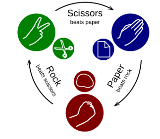

# The "Rock - Paper - Scissors" Game 
console-based JavaScript implementation of the "Rock - Paper - Scissors" game.

<a>Rock - Paper - Scissors</a> is simple two player game8 where you and your oponent (the computer) simultaniously choose one of the following three options: "**Rock**", "**Paper**" or "**Scissors**". The rules are a follows:
- Rock beat scissors
- Scissors beats paper
- Paper beats rock
The **winner** is the player whose choice beats the choise beats the choice of his oppenent. if both players choose the same option.(e.g. "paper"), the game outcome is "draw".